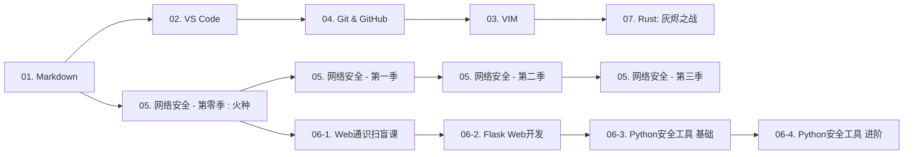
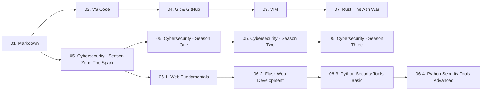

# 守夜者之书 / The Night Keeper's Book<!-- omit in toc -->

   

<!--python3 -m http.server 8000
http://localhost:8000

## 🎯 高优先级（读者直接感知）

| 方向              | 具体内容                               | 为什么重要                             |
| ----------------- | -------------------------------------- | -------------------------------------- |
| **阅读进度/标记** | 记录读者看到哪一章，下次访问继续       | 长篇教程的刚需，用 localStorage 存就行 |
| **最后更新时间**  | 每个页面底部显示“最后更新：2026-08-22” | 让读者知道内容是不是新鲜的             |

## 📈 中优先级（社区 & 增长）

| 方向              | 具体内容                             | 为什么重要                                     |
| ----------------- | ------------------------------------ | ---------------------------------------------- |
| **Giscus 评论区** | 用 GitHub Discussions 当评论系统     | 读者可以提问、讨论，社区感就出来了             |
| **社区笔记页面**  | `/community/` 展示所有 Fork 者的笔记 | 你的 README 里已经写了这个机制，网页版还没跟上 |
| **RSS Feed**      | 生成 `/feed.xml`，教程更新时自动推送 | 让读者订阅更新，不用天天刷 GitHub              |
| **社交元标签**    | Open Graph / Twitter Card 优化       | 分享到微信、Twitter 时显示好看的卡片           |

## 🔧 中低优先级（作者效率）

| 方向                       | 具体内容                            | 为什么重要                      |
| -------------------------- | ----------------------------------- | ------------------------------- |
| **GitHub Action 自动构建** | 推送 Markdown 时自动运行 `build.py` | 不用每次本地跑完再 push，全自动 |
| **Markdown 实时预览**      | 写教程时能在浏览器实时看到渲染效果  | 提升写作体验                    |
| **文章统计**               | 每篇文章字数、阅读时间自动计算      | 比固定“约30分钟”更准确          |
| **中文/英文内容同步状态**  | 显示哪些教程已翻译、哪些待翻译      | 让读者知道进度                  |

## 💡 低优先级（锦上添花）

| 方向             | 具体内容                                      |
| ---------------- | --------------------------------------------- |
| **打印优化**     | 为教程页加 `@media print` 样式，方便导出 PDF  |
| **键盘快捷键**   | `←` `→` 切换上一篇/下一篇，`/` 聚焦搜索       |
| **文章贡献指引** | 每个页面底部加“发现错误？在 GitHub 上修改”    |
| **访问统计**     | 集成 Umami 或 Plausible，知道哪些教程最受欢迎 |
-->

---

## 目录 / Table of Contents<!-- omit in toc -->

- [中文版](#中文版)
  - [:book: 这是什么](#book-这是什么)
  - [:books: 这里有什么](#books-这里有什么)
  - [:rocket: 从哪里开始](#rocket-从哪里开始)
  - [:globe\_with\_meridians: 关于守夜者](#globe_with_meridians-关于守夜者)
  - [:page\_facing\_up: 许可证](#page_facing_up-许可证)
- [English version](#english-version)
  - [:book: What is this?](#book-what-is-this)
  - [:books: What's inside?](#books-whats-inside)
  - [:rocket: Where to start?](#rocket-where-to-start)
  - [:globe\_with\_meridians: About the Night Keepers](#globe_with_meridians-about-the-night-keepers)
  - [:page\_facing\_up: License](#page_facing_up-license)

---

## 中文版

> 从零开始学安全。每天2小时，雷打不动。

### :book: 这是什么

这是一个**公开的学习笔记仓库**，记录一名守夜者从零开始学习网络安全的完整过程。

我是 **TheSilentOne-creator**（沉默者），守夜者的一员。我相信：

> 五年后、十年后、二十年后，世界和时间会给我们答案。

---

### :books: 这里有什么

- **:memo: 学习笔记**：每天学的内容，整理成笔记
- **:triangular_ruler: 教程系列**：从零开始的教程，中英双语
- **:computer: 代码练习**：写过的脚本、工具

---

### :rocket: 从哪里开始

- :blue_book: **基础工具与协作系列**（守夜者的利剑与盾牌）
- :computer: **网络安全世界**（守夜者的战场与使命）

| # | 教程 | 状态 | 链接 |
| :--- | :--- | :--- | :--- |
| 01 | **玩转 Markdown** | :white_check_mark: 已完成 | [开始阅读](<./中文 (Chinese)/01. 玩转 Markdown/01.玩转 Markdown.md>) |
| 02 | **玩转 VS Code** | :white_check_mark: 已完成 | [开始阅读](<./中文 (Chinese)/02. 玩转 VS Code/02. 玩转 VS Code.md>) |
| 03 | **VIM 从入门到得体** | :white_check_mark: 已完成 | [开始阅读](<./中文 (Chinese)/03. VIM 从入门到得体/03. VIM 从入门到得体.md>) |
| 04 | **拿捏 Git 与 GitHub** | :pencil: 等待中 | 敬请期待 |
| 05 | **这才是网络安全 (全六季)** | :construction: 编写中 | [开始阅读](<./中文 (Chinese)/05. 这才是网络安全 (全六季)/0. 这才是网络安全·第零季：火种/0. 这才是网络安全·第零季：火种.md>) |
| 06 | `[中阶]` **这才是 Python** | :pencil: 等待中 | 敬请期待 |
| 07 | `[进阶]` **最终章 - Rust：灰烬之战** | :construction: 编写中 | [开始阅读](<./中文 (Chinese)/07. [进阶] 最终章 - Rust：灰烬之战/07. [进阶] 最终章 - Rust：灰烬之战.md>) |
| 08 | `[进阶]` **详解计算机科学丛书** | :construction: 编写中 | [开始阅读](<./中文 (Chinese)/08. [进阶] 详解计算机科学丛书/README.md>) |

> 所有教程采用**中英双语**编写：先用中文写完，再翻译成英文。

---

#### 各教程介绍<!-- omit in toc -->

1. **玩转 Markdown** - 别再傻乎乎地用记事本写笔记了！  
   - 你是不是还在忍受Word排版时图片乱飞、格式崩溃的痛苦？或者写了半天笔记，粘到网页上丑得自己都不想看？  
   - **Markdown** 就是来解决这个问题的。它像极了武林秘籍里的 **“轻功”** ——学起来只需要十分钟，但用好了能让你飞一辈子。  
   - 这套教程不跟你讲复杂的语法树，只教你在写代码笔记、写GitHub Readme、甚至写书时，**那最常用的5%语法**。  
   - **学完这一课，你将解锁：** 优雅地写出一份连程序员看了都想Star的笔记，从此告别鼠标狂点格式刷的原始时代。

2. **玩转 VS Code** - 武装你的“瑞士军刀”
   - 如果把写代码比作做饭，那VS Code就是你的**厨房工作台**。你可以用它切菜（写代码）、看火候（调试）、甚至下单买菜（Git集成）。  
   - 很多人用了好几年VS Code，还把它当成一个高级记事本——就像买了辆法拉利却只用来推着走。  
   - 本教程手把手教你装上那些 **“开了挂”的插件** ：远程写服务器代码、AI帮你补全、一键格式化乱糟糟的代码。  
   - **学完这一课，你将解锁：** 一个能让你在任何地方（甚至iPad上）写代码的云端开发环境，让写代码变成一种享受。

3. **VIM 从入门到得体** - 没有图形界面？那就用键盘征服世界
   - 听好了，菜鸟。当你还在纠结用鼠标点击“保存”按钮时，真正的黑客早已在VIM里键入 `:wq` 潇洒离去。
   - VIM是Linux系统里的 **“文字游戏”** ，它的学习曲线陡峭得像悬崖。但只要你爬上去了，就能体验到“手不离键盘，思绪如流水”的快感。
   - 我们只讲10节必修课，外加6个选修方向。绝不让你背那些一辈子用不到的花哨命令。你只需要学会：**怎么进去、怎么改字、怎么保存、怎么拍桌子骂娘然后退出。**
   - **学完这一课，你将解锁：** 在任何一个服务器上（哪怕只有命令行）都能流畅写代码的底气，以及成为室友眼中的“键盘侠”。

4. **拿捏 Git 与 GitHub** - 别再把你的代码存桌面了！
   - 你一定经历过这种绝望：`毕业论文_最终版.doc`、`毕业论文_最终版2.doc`、`毕业论文_打死也不改版.doc`……
   - **Git** 就是专门治这种“版本混乱”病的。它不仅记下了你每次改了啥，还能让你一键回到“昨天下午那个还没改崩的状态”。
   - 而 **GitHub** 是程序员的“朋友圈”，也是最牛逼的代码仓库。这套教程会教你：**如何把代码白嫖（Fork）下来、如何更新、以及如何把你的开源项目变成简历上的亮点。**
   - **学完这一课，你将解锁：** 拥有一个绿油油的GitHub贡献墙，以及那句让你底气十足的：“来，先 Fork 我的项目。”

5. **这才是网络安全 (全六季)** - 省下一万块的培训，**免费**看完这一套
   - 你有没有过这种经历：看了好多碎片化的文章，觉得“我行了”，一上手发现“我啥也不会”？
   - 全六季采用 **“相声式”教学法** —— 保证没有昏昏欲睡的理论，只有让你笑完还能记住的攻击手法。比如：“什么叫XSS？就是你在我评论区发了个脚本，我一打开网页，弹窗说‘你被耍了’。”
   - 从Web渗透到内网漫游，从信息收集到日志溯源，这条路我给你铺好了，你只需要跟着走。
   - **学完这一课，你将解锁：** 完整的网络安全知识体系 + 一套可以在面试官面前侃侃而谈的实战项目经验。

6. **这才是 Python** - 从零开始，用 Python 武装你的安全工具链
   - Python 是渗透测试行业的“通用胶水”——从信息收集到漏洞利用，从爬虫到图形界面，它无处不在。
   - 这个系列分为四个子课程，从 Web 基础到 Flask 开发，从爬虫到 GUI，从基础脚本到进阶安全工具——一条完整的 Python 学习路径。
   - **子课程：**
     - **06-1. Web 通识扫盲课**：零基础也能懂的 Web 世界。HTML、CSS、JavaScript 各自负责什么，浏览器和服务器之间怎么通信。
     - **06-2. Flask Web 开发**：用 Python 搭建你的第一个网站。从路由到模板，从表单到数据库，写出的网站以后就是你测试安全工具的“自家靶场”。
     - **06-3. 用 Python 写安全工具（基础）**：从爬虫到 GUI。把你的脚本包装成带界面的工具，让别人双击就能用。
     - **06-4. 用 Python 写安全工具（进阶）**：网安视角的 Python——端口扫描器、弱口令爆破、日志分析脚本。把枯燥的渗透工作自动化。

7. `[进阶]` **Rust：灰烬之战** - 这不是一门语言课，这是一场你必须写 Rust 才能活下来的战争
   - “碎镜”爆发后的第 247 天。你在数据废墟中收到一个信号：“守夜者，你还在吗？”要回应它，你必须先学会用 Rust 锻造自己的武器。
   - 从“爆破弱口令”到“日志猎手”，从“并发反击”到“自毁与永恒”——15 个章节，12 个真实工具，一段从废墟到牺牲的完整叙事。
   - 所有权不再是晦涩的内存模型，而是“情报原件只有一份，读完必须销毁”。生命周期不再是编译器报错，而是“牛奶的保质期”。
   - **学完这一课，你将解锁：** 一门高性能系统语言的完整实战能力，以及一段你永远忘不了的战争记忆。

8. `[进阶]` **详解计算机科学丛书** - 追随计算机科学的初心，用“大块头”体会编程之道
   - 如果你觉得看完了上面的教程，感觉自己“啥都会了但又啥都不会”，说明你缺了**内功**。
   - 这是一份读书笔记/伴读指南。针对那些经典的“黑皮书”（如《计算机网络》、《深入理解计算机系统》）。
   - 我不会帮你读书，但我告诉你**哪些章节是面试必考的、哪些算法是写Exploit必用的、哪些理论可以跳过。**
   - **学完这一课，你将解锁：** 一颗计算机科学的大脑。从此以后，任何新的漏洞和框架在你眼里，都不过是基础原理的排列组合。

---

#### 怎么学？<!-- omit in toc -->

本教程完全面向零基础，哪怕你连最基本的工具都不会用。

为了让基础工具（`01`~`04`）的学习不枯燥，并让你尽快接触到安全知识的乐趣，建议你按照以下路径学习。

**核心原则：以网络安全为主线，工具和语言在实战中随用随学。**

1. **务必先学 `01. 玩转 Markdown`**  
   这是你写文档、做笔记，乃至**写漏洞报告**时都要使用的一种**标记语言**（类似于 Word，但是纯文本！）。它是整个学习旅程的书写基础。

2. **在学 Markdown 的同时，可以开始看 `05. 这才是网络安全` 的“第零季：火种”**  
   第零季讲的是黑客文化与精神，非常有趣，像听故事一样。它不需要任何技术基础，适合在你练习 Markdown 语法时当作调剂。这是主线剧情的前传，先点燃你的热情。

3. **接下来学习 `02. 玩转 VS Code`**  
   学好了这将是你写代码、做笔记、写 Markdown……的**利器**，你的核心工作台。同时，你可以正式进入 `05. 这才是网络安全` 的**第一季**，开始学习真正的渗透测试基础。

4. **在学第一季的同时，顺手拿下 `04. 拿捏 Git 与 GitHub`**  
   写代码、做项目，离不开版本控制。Git 帮你管理每一次修改，GitHub 让你的项目能被全世界看到。这时候学 Git，是因为你已经开始写安全练习的代码，需要版本管理了。

5. **进入第一季后半段或第二季时，开始 `03. VIM 从入门到得体`**  
   等你需要操作远程服务器，或者想在终端里更快地编辑配置文件时，VIM 就是你的必修课。它很难，但和网络安全同步学会让你事半功倍。

6. **想学 Python 写工具？跟着 Python 系列走**  
   Python 系列 (`06-1`~`06-4`) 是一条完整的路径：先学 Web 基础 (`06-1`) → 再学 Flask 开发 (`06-2`) → 然后写带界面的爬虫工具 (`06-3`) → 最后进阶到安全工具开发 (`06-4`)。你可以按顺序学，也可以根据需要在安全实战中随时跳进某一本。

7. **当需要编写自己的扫描器、利用脚本或高性能工具时，请出神兵 `07. Rust：灰烬之战`**  
   这不是一门普通的编程语言课。这是一场你必须用 Rust 才能活下来的战争。当你在安全学习中需要更快、更底层的工具时，这本叙事驱动的 Rust 实战教程会在故事中教会你一切。

8. **最后，修炼内功：`08. 详解计算机科学丛书`**  
   如果你觉得看完了上面的教程，感觉自己“啥都会了但又啥都不会”，说明你缺了**内功**。这份伴读指南会告诉你，那些经典的“黑皮书”里，哪些是必读的、哪些可以跳过。

---

接下来的 `05. 这才是网络安全 (全六季)` 就可以按照顺序深入学习了。

---

### :globe_with_meridians: 关于守夜者

我是守夜者的一员。守夜者是一个技术学习社区。

- **我们相信**：从零开始，一起进步
- **我们不做**：非法攻击、盈利、暴露成员身份

**守夜者宣言**：长夜将至，我从今开始守夜，今夜如此，夜夜皆然。

> **加入我们**:  
> 如果你也在从零开始，想找个人一起守夜，Fork 这个仓库，写下你的第一行笔记。  
> Fork后，在 `/community/` 下新建 `你的名字.md`，写下你今天的收获。

---

### :page_facing_up: 许可证

本仓库内容采用 [CC BY-NC-SA 4.0](https://creativecommons.org/licenses/by-nc-sa/4.0/) 协议（署名-非商业性使用-相同方式共享）。

---

## English version

> *Learning security from scratch. Two hours a day, rain or shine.*

### :book: What is this?

An open notebook documenting my journey from zero to cybersecurity.

I am **TheSilentOne-creator** (The Silent One), a member of the Night Keepers. I believe:

> *Five years, ten years, twenty years from now—the world and time will give us the answer.*

---

### :books: What's inside?

- **:memo: Learning Notes**: Daily study notes, organized and distilled
- **:triangular_ruler: Tutorial Series**: Step-by-step tutorials, bilingual (Chinese / English)
- **:computer: Code Practice**: Scripts and tools I've written along the way

---

### :rocket: Where to start?

- :blue_book: **Core Tools & Collaboration** (The Night Keeper's Sword & Shield)
- :computer: **The World of Cybersecurity** (The Night Keeper's Battlefield & Mission)

| # | Tutorial | Status | Link |
| :--- | :--- | :--- | :--- |
| 01 | **Mastering Markdown** | :pencil: Translating | Coming soon |
| 02 | **Mastering VS Code** | :pencil: Translating | Coming soon |
| 03 | **VIM: From Entry to Decency** | :pencil: Translating | Coming soon |
| 04 | **Git & GitHub by the Horns** | :pencil: Planned | Coming soon |
| 05 | **This Is Cybersecurity (6 Seasons)** | :construction: Writing | Coming soon |
| 06 | `[Intermediate]` **This Is Python** | :pencil: Planned | Coming soon |
| 07 | `[Advanced]` **Rust: The Ash War** | :construction: Writing | Coming soon |
| 08 | `[Advanced]` **The Computer Science Canon Explained** | :pencil: Translating | Coming soon |

> *All tutorials are bilingual: first written in Chinese, then translated into English.*

---

#### Tutorial Introductions<!-- omit in toc -->

1. **Mastering Markdown** -- Stop using Notepad like a caveman!
    - Are you still suffering from images flying everywhere and formats crashing in Word? Or have you written pages of notes that look so ugly on a webpage you don't even want to look at them?
    - **Markdown** is here to solve that. It's like the legendary **"Qinggong"** (lightness skill) in martial arts novels—takes ten minutes to learn, but using it well will make you fly for a lifetime.
    - This tutorial won't bore you with complex syntax trees. It only teaches you the **top 5% of syntax** you'll actually use for code notes, GitHub Readmes, and even writing books.
    - **What you'll unlock:** The ability to elegantly write notes that even a programmer would want to Star, bidding farewell to the primitive era of frantically clicking the format painter with your mouse.

2. **Mastering VS Code** -- Arm your "Swiss Army Knife"
    - If writing code is like cooking, then VS Code is your **kitchen workbench**. You can use it to chop vegetables (write code), watch the heat (debug), and even order groceries (Git integration).
    - Many people use VS Code for years but treat it like a fancy Notepad—it's like buying a Ferrari and only using it to push it around.
    - This tutorial will walk you through installing those **"cheat-code" plugins**: writing code on a remote server, AI-powered auto-completion, and formatting messy code with one click.
    - **What you'll unlock:** A cloud development environment that lets you write code anywhere (even on an iPad), turning coding into pure enjoyment.

3. **VIM: From Entry to Decency** -- No GUI? Conquer the world with your keyboard.
    - Listen up, rookie. While you're still fumbling with the mouse to click the "Save" button, a true hacker has already typed `:wq` in VIM and left the building.
    - VIM is the **"text-based game"** in Linux systems. Its learning curve is as steep as a cliff. But once you climb it, you'll experience the flow state of "hands never leaving the keyboard, thoughts flowing like water."
    - We cover 10 mandatory lessons plus 6 elective modules. I won't make you memorize fancy commands you'll never use. You just need to learn: **how to enter, how to change text, how to save, and how to slam the table, curse, and exit.**
    - **What you'll unlock:** The confidence to smoothly write code on any server (even one with only a command line), and the status of becoming the "Keyboard Warrior" in the eyes of your roommates.

4. **Git & GitHub by the Horns** -- Stop saving your code to your desktop!
    - You've definitely experienced this despair: `Thesis_Final.doc`, `Thesis_Final_v2.doc`, `Thesis_I_Swear_This_Is_The_Last_One.doc`...
    - **Git** is the cure for this "version chaos" disease. It not only remembers every change you made, but also lets you instantly return to "that state yesterday afternoon before everything broke."
    - And **GitHub** is the programmer's "social circle" and the most awesome code repository. This tutorial will teach you: **how to clone code for free (Fork), how to update it, and how to turn your open-source project into a highlight on your resume.**
    - **What you'll unlock:** A super green GitHub contribution wall, and the confidence to say: "Hey, just Fork my project first."

5. **This Is Cybersecurity (6 Seasons)** -- Save yourself the cost of a training course. Watch this for **free** instead.
    - Ever had this experience: read tons of fragmented articles, felt like "I've got this," then actually tried something and realized "I know nothing"?
    - All six seasons use a **"Comedy Show" teaching style**—no boring theories, only attack techniques you'll remember after a good laugh. Like: "What's XSS? It's when someone posts a script in my comments, and when I open the page, a popup says 'You got pwned.'"
    - From Web penetration testing to intranet roaming, from information gathering to log tracing, I've paved this path for you. You just need to follow it.
    - **What you'll unlock:** A complete cybersecurity knowledge system + a set of hands-on project experiences you can confidently discuss in front of an interviewer.

6. **This Is Python** -- From scratch, arm your security toolchain with Python.
    - Python is the "universal glue" of the penetration testing world—from information gathering to exploit development, from web scraping to GUI applications, it's everywhere.
    - This series is divided into four sub-courses, covering everything from Web fundamentals to Flask development, from scraping to GUI, from basic scripting to advanced security tool development—a complete Python learning path.
    - **Sub-courses:**
      - **06-1. Web Fundamentals Crash Course**: Understand how the Web works, from scratch. What HTML, CSS, and JavaScript each do, and how browsers communicate with servers.
      - **06-2. Flask Web Development**: Build your first website with Python. From routes to templates, from forms to databases—the site you build will later become your personal testing ground for security tools.
      - **06-3. Writing Security Tools in Python (Basic)**: From web scraping to GUI. Wrap your scripts in a graphical interface so others can use them with a double-click.
      - **06-4. `[Advanced]` Writing Security Tools in Python (Advanced)**: Python from a security perspective—port scanners, brute-force tools, log analysis scripts. Automate the tedious parts of penetration testing.

7. `[Advanced]` **Rust: The Ash War** -- This is not a language course. This is a war you must write Rust to survive.
    - Day 247 after the "Shattered Mirror" outbreak. You intercept a signal from the data ruins: "Keeper, are you still there?" To answer, you must first forge your weapons in Rust.
    - From "Brute-forcing the Weak PIN" to "The Log Hunter", from "Concurrent Counterstrike" to "Self-Destruct and Eternity"—15 chapters, 12 real tools, one complete narrative from the ashes to sacrifice.
    - Ownership is no longer a complex memory model, but "Only one copy of the intel exists. Whoever takes it, reads it once, and destroys it." Lifetimes are no longer compiler errors, but "the expiration date on a carton of milk."
    - **What you'll unlock:** Complete hands-on capability in a high-performance systems language, and a war story you'll never forget.

8. `[Advanced]` **The Computer Science Canon Explained** -- Return to the heart of computer science. Grasp the Tao of programming through these mighty tomes.
    - If you finish the tutorials above and feel like you "know everything and nothing at all," it means you're lacking **inner strength**.
    - This is a reading guide/companion. It's targeted at those classic "black books" (like *Computer Networking*, *Computer Systems: A Programmer's Perspective*).
    - I won't read the book for you, but I will tell you **which chapters are must-knows for interviews, which algorithms are essential for writing exploits, and which theories you can skip.**
    - **What you'll unlock:** A computer science brain. From then on, any new vulnerability or framework will just look like permutations and combinations of fundamental principles.

---

#### How to learn?<!-- omit in toc -->

This tutorial is entirely for absolute beginners, even if you don't know the most basic tools.

To keep the foundational tools (`01`–`04`) from feeling boring and to get you into the fun of security knowledge as soon as possible, here's the recommended learning path.

**Core principle: Cybersecurity is the main quest. Tools and languages are side quests, learned as needed.**

---

1. **Start with `01. Mastering Markdown`**  
   This is the **markup language** (think Word, but pure text!) you'll use for writing documents, taking notes, and even **drafting vulnerability reports**. It's the writing foundation of your entire journey.

2. **While learning Markdown, start watching `05. This Is Cybersecurity` Season Zero: The Spark**  
   Season Zero is about hacker culture and spirit. It's incredibly fun, like story time. It requires zero technical background and is perfect as a breather while you practice Markdown. This is the prequel to the main story—let it ignite your passion first.

3. **Next, move on to `02. Mastering VS Code`**  
   Once mastered, this will be your **ultimate weapon** for writing code, taking notes, composing Markdown… your core workbench. At the same time, you can officially dive into **Season One** of `05. This Is Cybersecurity` and start learning real penetration testing fundamentals.

4. **While studying Season One, pick up `04. Git & GitHub by the Horns`**  
   Writing code and doing projects requires version control. Git manages your changes, GitHub lets the world see your work. You're learning this now because you're starting to write security practice code.

5. **In the latter half of Season One or during Season Two, begin `03. VIM: From Entry to Decency`**  
   When you need to operate remote servers, or want to edit config files faster in the terminal, VIM becomes essential. It's tough, but learning it alongside cybersecurity doubles your efficiency.

6. **Want to learn Python for writing tools? Follow the Python track**  
   The Python series (`06-1`–`06-4`) is a complete path: start with Web Fundamentals (`06-1`) → then Flask Development (`06-2`) → then write GUI-based scraper tools (`06-3`) → finally advance to security tool development (`06-4`). You can follow the sequence, or jump into any course as needed during your security practice.

7. **When you need to write your own scanners, exploits, or high-performance tools, unsheathe `07. Rust: The Ash War`**  
   This is not an ordinary programming language course. This is a war you must survive by writing Rust. When your security work demands faster, lower-level tools, this narrative-driven Rust tutorial will teach you everything through its story.

8. **Finally, cultivate your inner strength: `08. The Computer Science Canon Explained`**  
   If you finish the tutorials above and feel like you "know everything and nothing at all," it means you're lacking **inner strength**. This reading companion tells you which of the classic "black books" are essential and which can be skimmed.

After that, you can follow the rest of `05. This Is Cybersecurity (6 Seasons)` in order.

---

### :globe_with_meridians: About the Night Keepers

I am a member of the Night Keepers, a tech learning community.

- **We believe**: Start from zero. Progress together.
- **We do not engage in**: Illegal attacks, profit-making, or exposing members' identities.

**The Night Keeper's Oath**: *Night gathers, and now my watch begins. This night, and all nights to come.*

---

> **Join us**:  
> If you're also starting from zero and looking for someone to keep watch with, Fork this repository and write your first note.  
> After forking, create a new file under `/community/` named `your-name.md` and write down what you learned today.

---

### :page_facing_up: License

*This repository is licensed under the [CC BY-NC-SA 4.0](https://creativecommons.org/licenses/by-nc-sa/4.0/) license (Attribution-NonCommercial-ShareAlike).*
